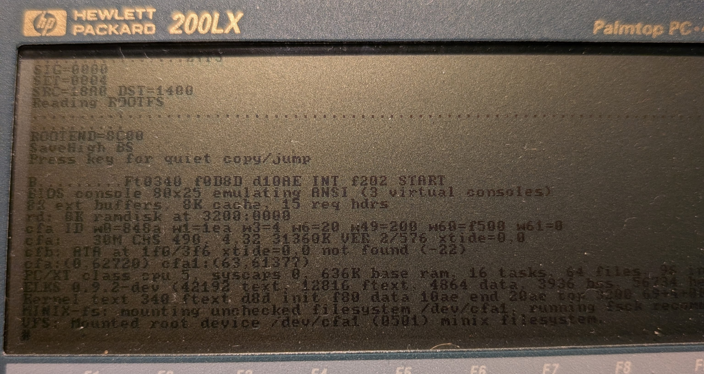
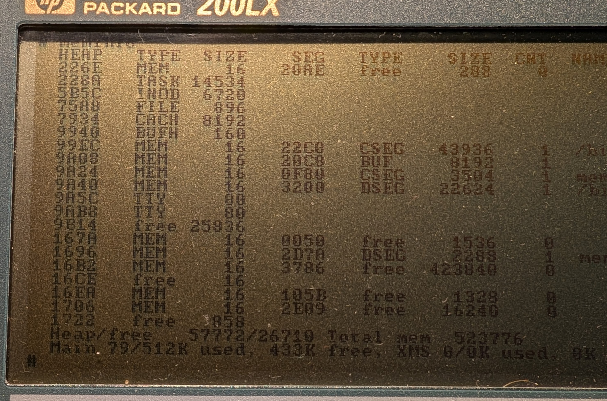
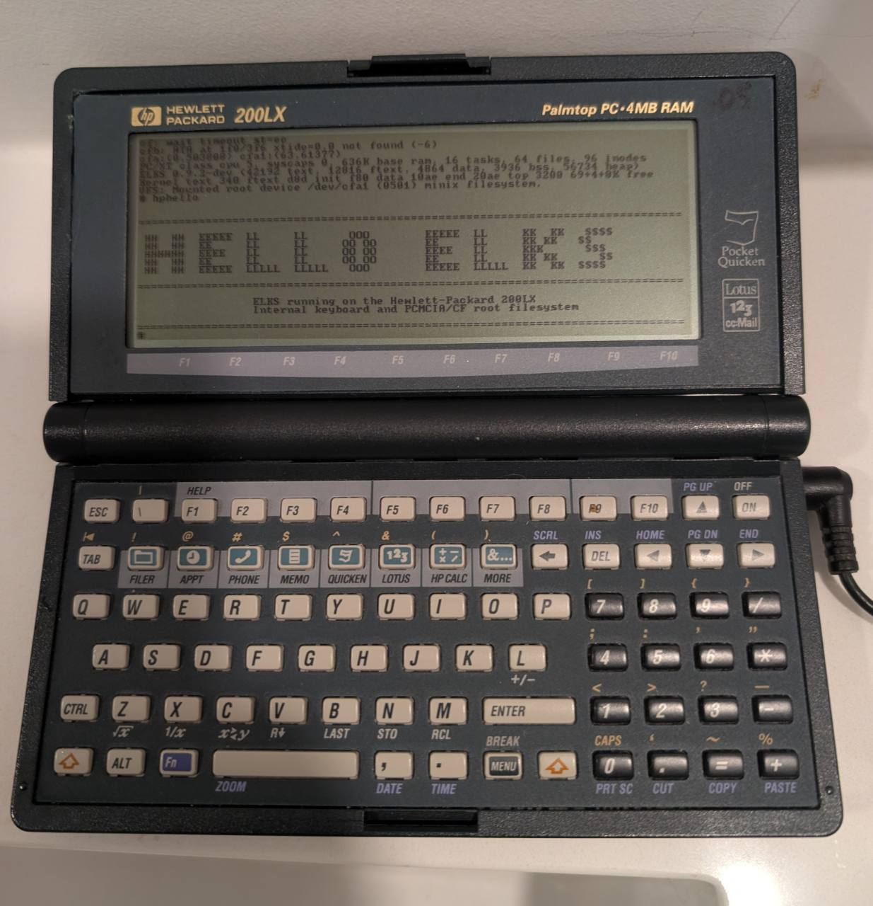
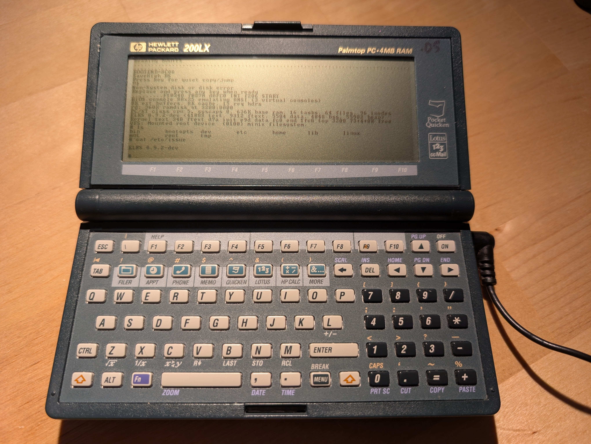
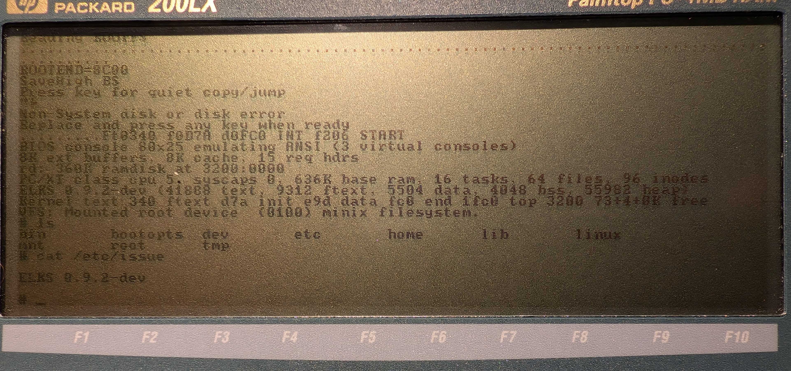

# ELKS Linux on the HP 200LX

A **downstream fork of [ELKS](https://github.com/ghaerr/elks)** for the **Hewlett-Packard 200LX palmtop**.

This is community bring-up work, not an official ELKS release. It tracks the HP 200LX effort discussed in [ghaerr/elks#2236](https://github.com/ghaerr/elks/issues/2236). Upstream ELKS credit and the GPLv2 license remain with the ELKS authors.

---

## Release 3.1 - RAMdisk Memory Fix

**Release 3.1 is the recommended HP 200LX ELKS build.** It keeps the Release 3 PCMCIA/CF persistent root filesystem path, but fixes the unused RAMdisk reservation that left ELKS with much less conventional memory for programs.

Release 3.1 was validated on real HP 200LX hardware using the MEMLAB16 test build. The kernel now reports:

```text
rd: 0K ramdisk at 3200:0000
VFS: Mounted root device /dev/cfa1 (0501) minix filesystem.
```

The Release 3.1 memory test showed approximately:

```text
Main 79/512K used, 431K free
```



*Release 3.1/MEMLAB16 boot on real HP 200LX hardware: the kernel reports `rd: 0K ramdisk at 3200:0000` before mounting the PCMCIA/CF root filesystem.*



*Release 3.1/MEMLAB16 on real HP 200LX hardware: `meminfo` after booting with a 0K RAMdisk reservation.*

This is a boot-package update only. Use the Release 3 PCMCIA/CF root image package for the Minix root filesystem.

What changed from Release 3:

- `KERNBOP` was updated with the MEMLAB16/R3D46 kernel patch.
- The kernel reserves `0K` for the legacy RAMdisk instead of the old `360K` reservation.
- `ROOT092` remains in the DOS boot package for compatibility with the current `BTGVDX` loader path, but it no longer costs ELKS the old RAMdisk reservation after boot.
- The root filesystem is still the persistent PCMCIA/CF Minix partition mounted from `/dev/cfa1`.
- `vi` now has enough memory to start; set `TERM=ansi` first.

### Release 3.1 Artifacts

- Boot package: [`releases/hp200lx-release3.1.zip`](releases/hp200lx-release3.1.zip)
- PCMCIA/CF root image package: [`releases/hp200lx-release3-rootcf.zip`](releases/hp200lx-release3-rootcf.zip)
- Normal DOS entry point: `RUNELKS.BAT`
- Fallback DOS entry point: `RUNCARD.BAT`
- Kernel image inside the boot package: `KERNBOP`
- Root image inside the root package: `R3ROOT.IMG`

Checksums:

```text
4ce7788969635c625d4c21524e89cd9e4c07fb77266d67e36d9681cfce753461  hp200lx-release3.1.zip
bf6ac72d5f090cc3062876f910f477da61216cd171c0664fcfb2942ac4aa54d0  KERNBOP
f770d2be6d804cdfa6fa8e332533ee111b45401ec520e8ded2746530b854ca2a  hp200lx-release3-rootcf.zip
2f346ad04526a37536178e463f78b478b774e051278572361f6e72bdec704aa1  R3ROOT.IMG
```

### Install Release 3.1

Follow the Release 3 install process, but use [`hp200lx-release3.1.zip`](releases/hp200lx-release3.1.zip) for the DOS `C:\ELKS` boot files. The root image is unchanged from Release 3, so continue to use [`hp200lx-release3-rootcf.zip`](releases/hp200lx-release3-rootcf.zip) for the PCMCIA/CF card.

After ELKS boots, set `TERM` before starting `vi`:

```text
TERM=ansi
export TERM
vi
```

### Release 3.1 Notes

- `BTGVDX` may still print `ROOTEND=8C00`; that is expected because the loader path is unchanged.
- The important kernel clue is `rd: 0K ramdisk at 3200:0000`.
- A future cleanup can remove the custom loader RAMdisk copy path entirely, but Release 3.1 already reclaims the memory for ELKS after boot.

---

## Release 3 - Persistent PCMCIA/CF Root Filesystem

**Release 3 boots ELKS on a real HP 200LX with the built-in keyboard and a persistent Minix root filesystem on a PCMCIA/CF card.**

Release 2 proved the HP 200LX could run ELKS as a self-contained palmtop using the internal keyboard. Release 3 adds the next major piece: ELKS can now mount the PCMCIA/CF card as its root filesystem, so files and configuration changes survive a reboot.



*Release 3 on real HP 200LX hardware: ELKS running from the internal keyboard with a persistent PCMCIA/CF Minix root filesystem.*

What works in Release 3:

- Boots ELKS to `/bin/sh` on a stock-clock HP 200LX with 4 MB RAM.
- Uses the built-in HP 200LX keyboard; no external keyboard is required.
- Mounts the PCMCIA/CF Minix partition as `/`.
- Persists files across a full reboot.
- Includes the regular ELKS 2880K Minix userland.
- Adds `/bin/hphello`, a small HP 200LX release screenshot helper.
- Includes programs such as `tetris`, `digger`, `elkirc`, `memopad`, Nano-X tools, and `nxjpeg` (not tested yet).

Expected boot line:

```text
VFS: Mounted root device /dev/cfa1 (0501) minix filesystem.
```

### Release 3 Artifacts

- Boot package: [`releases/hp200lx-release3.zip`](releases/hp200lx-release3.zip)
- PCMCIA/CF root image package: [`releases/hp200lx-release3-rootcf.zip`](releases/hp200lx-release3-rootcf.zip)
- Optional hpreboot test root image package: [`releases/hp200lx-release3-hpreboot-rootcf.zip`](releases/hp200lx-release3-hpreboot-rootcf.zip)
- Normal DOS entry point: `RUNELKS.BAT`
- Fallback DOS entry point: `RUNCARD.BAT`
- Kernel image inside the boot package: `KERNBOP`
- Root image inside the root package: `R3ROOT.IMG`

Checksums:

```text
77f243dd0bcdfadb8d36bfc9271ecc37d47c15904b1d13a9f30b15de3e59b562  hp200lx-release3.zip
f770d2be6d804cdfa6fa8e332533ee111b45401ec520e8ded2746530b854ca2a  hp200lx-release3-rootcf.zip
2f346ad04526a37536178e463f78b478b774e051278572361f6e72bdec704aa1  R3ROOT.IMG
0c13fb4c85a19e94dbebc3d75a5bd1c28603837a9d32804facf9122ac5952a9a  hp200lx-release3-hpreboot-rootcf.zip
9f09d7476fc26196106d423ef6efc5d0abd57050802cf1d001b2673c9d3fdccd  hpreboot R3ROOT.IMG
```

### Install Release 3

Before starting, boot the HP 200LX to the DOS `C:` drive prompt, not into the built-in HP PIM application. In `AUTOEXEC.BAT`, comment out the `200` line so the PIM shell does not start automatically and more RAM remains available for ELKS:

```dos
REM 200
```

You need:

- An HP 200LX with DOS booting from the internal `C:` drive.
- A spare PCMCIA/CF card for the ELKS Minix root filesystem.
- A way to copy files to the HP 200LX internal DOS drive.
- A way to write a whole-card image to the spare CF card.

Release 3 uses a two-stage boot:

```text
Internal DOS C: drive       -> starts the ELKS loader from C:\ELKS
PCMCIA/CF Minix partition   -> becomes the ELKS root filesystem (/dev/cfa1)
```

This is intentionally conservative. A fully self-contained bootable PCMCIA/CF card was tested, but booting DOS and later using the same card as the ELKS root device proved less reliable on the HP 200LX. The stable Release 3 path keeps the boot bundle on internal DOS storage and uses the PCMCIA/CF card for ELKS persistent storage.

1. Download and unzip [`hp200lx-release3.zip`](releases/hp200lx-release3.zip).
2. Copy all files from `hp200lx-release3/` to `C:\ELKS` on the HP 200LX.
3. Download and unzip [`hp200lx-release3-rootcf.zip`](releases/hp200lx-release3-rootcf.zip).
4. Write `R3ROOT.IMG` to a spare CF card.

On Linux or macOS, this is typically something like:

   ```sh
   dd if=R3ROOT.IMG of=/dev/rdiskN bs=1m conv=sync
   ```

Replace `/dev/rdiskN` with the real card device. This overwrites the target device.

On Windows, [Raspberry Pi Imager](https://www.raspberrypi.com/software/) can write `R3ROOT.IMG` to the CF card using its custom image option. Be careful to select the CF card as the target, since this overwrites the card.

5. Boot the HP 200LX into DOS from the internal `C:` drive, landing at the DOS prompt rather than the HP PIM application. As above, this means the `200` line in `AUTOEXEC.BAT` should be commented out as `REM 200` to save RAM for ELKS.
6. Insert the prepared PCMCIA/CF card.
7. From DOS:

   ```dos
   C:
   CD \ELKS
   RUNELKS
   ```

If `RUNELKS` does not see the card, fully reboot back to DOS and try:

```dos
C:
CD \ELKS
RUNCARD
```

`RUNCARD` runs Richard Dubs' `CARDIO.EXE` before the normal HP 200LX CF setup path.

### Quick Persistence Test

After ELKS boots:

```text
cat /root/RELEASE3.TXT
hphello
echo r3test >/root/r3test.txt
sync
cat /root/r3test.txt
```

Then reboot fully back to DOS, run `RUNELKS` again, and check:

```text
cat /root/r3test.txt
```

If the file is still present, the PCMCIA/CF Minix root filesystem is persistent.

### Release 3 Files

The boot package contains:

| File | Purpose |
| --- | --- |
| `RUNELKS.BAT` | Normal Release 3 DOS entry point. |
| `RUNCARD.BAT` | Fallback entry point using `CARDIO.EXE` first. |
| `KERNBOP` | ELKS kernel image with HP 200LX keyboard and CF support. |
| `ROOT092` | Small boot ramdisk image used by the loader. |
| `BTGVDX.COM` | DOS loader with embedded `root=cfa1`. |
| `MKINTS.COM` | Interrupt-vector capture tool. |
| `CFEN34.COM` | HP 200LX CF setup helper. |
| `CFEN34.ASM` | Source for `CFEN34.COM`. |
| `CARDIO.EXE` | Richard Dubs card I/O enabler, used by fallback path. |

The root image contains one type `81` Minix partition:

```text
start sector: 63
size:         61377 sectors
ELKS device:  /dev/cfa1
```

The root image was compared with the official ELKS `fd2880-minix.img`; no official files are missing. Release 3 additionally includes:

```text
/bin/hphello
/root/RELEASE3.TXT
```

The optional hpreboot root image additionally includes:

```text
/bin/hpreboot
/root/HPREBOOT.TXT
```

`hpreboot` is a small HP 200LX reboot experiment. It runs `sync()` and then jumps directly to the BIOS reset vector at `FFFF:0000`, matching the tiny DOS `reboot.com` behavior that works on the HP 200LX DOS side. It is intended for testing only until the reset behavior is confirmed on real hardware.

### Release 3 Limitations

- This remains an experimental downstream/community build.
- The recommended boot path still starts from DOS on the internal `C:` drive.
- The PCMCIA/CF card provides persistent ELKS root storage, but it is not yet a fully self-booting single-card installer.
- The HP 200LX keyboard and CF support are proven on real hardware but still need cleanup before they could be proposed upstream.
- HP-specific firmware features such as display zoom, contrast control, inverse video, and other special key combinations remain future work.

---

## Release 2 - Internal Keyboard

Release 2 boots ELKS to a usable interactive shell on a real HP 200LX with working input from the built-in HP 200LX keyboard. It was the first self-contained HP 200LX ELKS release: no external keyboard was needed.



What works in Release 2:

- Boots to `/bin/sh` using the BIOS console and RAM-root Minix filesystem.
- The built-in HP 200LX keyboard types into the ELKS shell.
- Normal letters, numbers, punctuation, Enter, Backspace, Tab, and Space work.
- Held Shift and held Ctrl work.
- Shift plus the blue HP application/menu keys produces expected shifted symbols such as `! @ # $ ^ & ( )`.
- `fork()` and `exec()` work; commands such as `ls` and `cat` run from the RAM-root filesystem.

Release 3 supersedes Release 2 for normal use because it adds persistent PCMCIA/CF root storage.

Release 2 artifact:

- Package: [`releases/hp200lx-release2.zip`](releases/hp200lx-release2.zip)
- Tested DOS entry point: `RUNN59`
- Kernel image inside the package: `KERNBOP`
- Package SHA256: `2be5647745ae6a523262a5c21e51c3fca0295ae6abfcf59272673eaca3a4a6c1`



---

## Release 1 - External Keyboard Bring-Up

Release 1 proved the core boot path: ELKS could boot to a shell on the HP 200LX, run from a RAM-root filesystem, and accept input through an external serial keyboard path. Release 2 replaced that with the internal keyboard, and Release 3 adds persistent PCMCIA/CF root storage.


*Apple Newton keyboard used for the Release 1 external keyboard bring-up path.*

---

## How It Works

### DOS Loader Chain

The HP 200LX boots DOS first. The Release 3 boot package then uses the DOS loader chain descended from Richard Dubs' MINIX-on-HP-200LX work to prepare the machine and launch ELKS.

### BIOS Console

Release 3 uses the BIOS console path, which matches the HP 200LX display hardware well enough for a reliable text shell.

### Direct HP 200LX Keyboard Scanner

The HP 200LX does not behave like a normal PC/XT keyboard. Release 3 keeps the direct HP 200LX keyboard matrix scanner proven in Release 2. The scanner runs from the kernel idle loop and feeds decoded characters into the console tty queue:

```text
idle loop -> HP 200LX scanner -> Console_conin() -> tty input queue -> shell
```

### PCMCIA/CF Root Filesystem

The HP 200LX CF setup helper prepares the card so the ELKS CF/ATA path can see it as `/dev/cfa`. The Release 3 loader passes `root=cfa1`, and the kernel mounts the Minix partition as `/`.

The critical successful boot line is:

```text
VFS: Mounted root device /dev/cfa1 (0501) minix filesystem.
```

### Why the Boot Files Stay on C:

A cleaner single-card design was tested: FAT boot partition plus Minix root partition on one PCMCIA/CF card. It is a good future goal, but on the HP 200LX the handoff from DOS booting the card to ELKS reusing the same card was not stable enough for this release.

Release 3 therefore ships the practical, tested design: DOS boot files on the internal `C:` drive, persistent ELKS root on the PCMCIA/CF card.

---

## Roadmap

- Test networking with a dual PCMCIA setup, either using an [Accurite DoubleSlot PCMCIA doubler](https://web.archive.org/web/20011222100220/http://www.accurite.com/dslot.html) if one becomes available, or  [yyzkevin](https://github.com/yyzkevin)'s planned [PicoPCMCIA](https://www.yyzkevin.com/picopcmcia/) card once released, so a network card can be added alongside storage.
- Clean up the HP 200LX keyboard scanner into a maintainable platform-specific driver.
- Clean up the CF support and boot helpers for a future upstreamable shape.
- Revisit a fully self-contained PCMCIA/CF boot card as a possible Release 4.
- Document the final tuple map and keyboard behavior in `docs/hp200lx`.
- Review HP 200LX BIOS/video functions for display zoom, contrast, inverse video, and related key combinations.
- Stress-test the persistent filesystem under heavier writes and longer sessions.
- Review double-speed HP 200LX units separately; Release 3 was tested on a stock-clock unit.

---

## Credits

- [ELKS](https://github.com/ghaerr/elks) and its authors - the kernel this builds on (GPLv2).
- **Greg Haerr** and the ELKS community - for the upstream project and discussion in [ghaerr/elks#2236](https://github.com/ghaerr/elks/issues/2236).
- **Richard L. Dubs** - the MINIX-on-HP-200LX work that this DOS boot/loader chain descends from; see the archived [`l00nix/dubs-minix-repo`](https://github.com/l00nix/dubs-minix-repo).
- The HP 100LX/200LX Developer's Guide and HP 200LX user documentation - for low-level keyboard, BIOS, and display details.
- The [`l00nix/gentleos-hp200lx`](https://github.com/l00nix/gentleos-hp200lx) work - for prior evidence that the internal HP 200LX keyboard can be driven directly.
- All real-hardware testing in this repo was done on an HP 200LX with 4 MB RAM and PCMCIA/CF storage.
