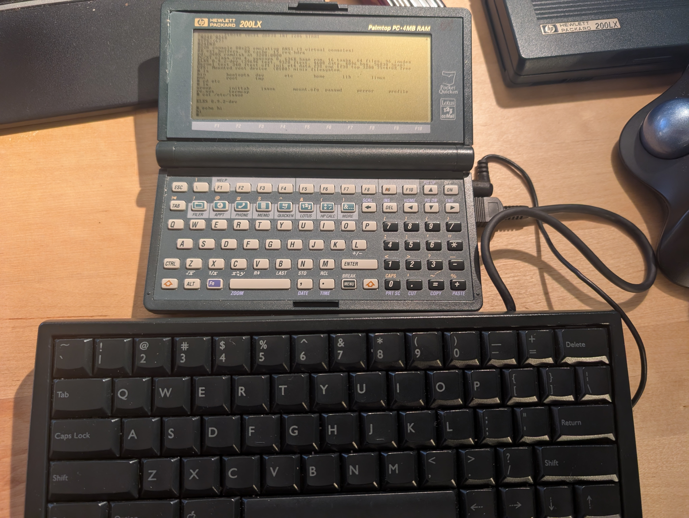
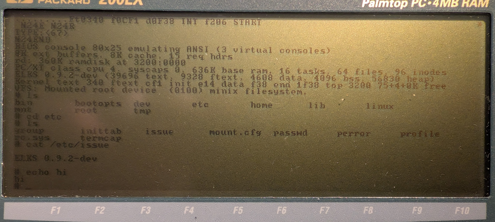
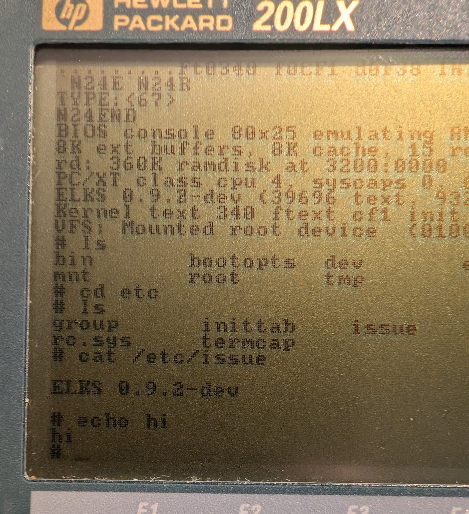

# ELKS Linux on the HP 200LX

A **downstream fork of [ELKS](https://github.com/ghaerr/elks)** that brings the
ELKS 16-bit Unix-like kernel up on **Hewlett-Packard 200LX palmtop** hardware.

> This is community bring-up work, not an official ELKS release. It is a fork of
> `ghaerr/elks`; the upstream project's own README is preserved as
> [`UPSTREAM-README.md`](UPSTREAM-README.md). All upstream credit and the GPLv2
> license remain with the ELKS authors. This fork tracks the HP 200LX effort
> discussed in [ghaerr/elks#2236](https://github.com/ghaerr/elks/issues/2236).

---

## Release 1 — "Newton" (Partial Success)

**Release 1 boots ELKS to a usable interactive shell on a real, stock-clock HP
200LX, with working keyboard input — but only via an external Apple Newton
keyboard on the serial port.** The built-in HP 200LX keyboard does **not** work
yet.



*Dev setup: an Apple Newton keyboard (foreground) wired to the HP 200LX serial
port, with the ELKS shell on screen.*

What works in Release 1:

- Boots cleanly to `/bin/sh` (BIOS console, RAM-root minix filesystem).
- **Apple Newton keyboard** (serial) types into the shell — letters, Shift,
  CapsLock, Ctrl (`^C`/`^D`), Tab, Return, Backspace, arrows.
- **`fork()`/`exec()` work** — external commands like `ls` and `cat` run; the
  root filesystem is stable.

```
# ls
bin   bootopts  dev  etc  home  lib  linux  mnt  root  tmp
# cd etc
# cat /etc/issue
ELKS 0.9.2-dev
# echo hi
hi
```



*N24 on hardware: the boot banner (`top 3200 ... free`) followed by a working
`ls` / `cd etc` / `ls` / `cat /etc/issue` session typed on the Newton keyboard.*



*Close-up of the same session — `cat /etc/issue` printing `ELKS 0.9.2-dev`.*

### Release 1 limitations

- **The built-in HP 200LX keyboard does not work.** Input requires an
  external Apple Newton keyboard wired to the serial port. (This is the next
  major target — see the roadmap.)
- **Stock-clock units only.** A crystal-upgraded ("double-speed") 200LX
  additionally needs its Hornet clock registers programmed (as Stefan Peichl's
  `DSPEED.COM` does); that support is not yet in the kernel, so on a
  double-speed unit the serial keyboard produces garbage.
- **RAM is tight.** The root is a 360 KB RAM disk carved from conventional
  memory, leaving a usable ceiling of roughly ~150 KB. Good enough for a shell
  and small programs; a disk-based root is on the roadmap.
- **Reclaimed high memory is not yet stress-tested.** The memory-map fix
  boots cleanly and `fork()` succeeds without rootfs corruption, but the
  reclaimed ~76 KB above the ramdisk is only on the free list so far and has not
  been exercised under heavy memory pressure.
- **No kernel timer.** The HP 200LX's Hornet ASIC does not deliver the
  `IRQ0`/`Int 08h` timer tick to ELKS, so there are no `jiffies` and no
  timer-driven services. Input is polled from the kernel idle loop instead.

---

## How it works (the two key ideas)

1. **Idle-loop input.** Because the kernel timer never fires on this hardware,
   the usual timer-driven keyboard path is dead. Instead the serial UART is
   polled from the **kernel idle loop** (`init/main.c`), and decoded keystrokes
   are pushed into the console tty queue (`Console_conin()` → `chq_addch()` →
   `wake_up()`), which wakes the shell blocked in `tty_read()`. No timers, no
   interrupts required. `idle_halt` is patched from `hlt` to `sti; ret` so the
   idle task spins instead of waiting for an interrupt that never comes.

2. **RAM-root memory-map fix.** The DOS loader preloads the 360 KB RAM-disk
   root at a fixed segment (`0x3200`), but stock ELKS sized usable memory from
   BIOS `INT 12h` (636 KB) and assumed the ramdisk sat at the top of memory — so
   the process pool overlapped the root filesystem and `fork()` corrupted it.
   The fix caps the pool at the ramdisk start and adds the conventional RAM
   *above* the ramdisk back to the free list.

The detailed, blow-by-blow bring-up story (N0 → N24, including the dead ends) is
in [`docs/hp200lx/BRINGUP_LOG.md`](docs/hp200lx/BRINGUP_LOG.md). The forward plan
is in [`docs/hp200lx/STRATEGY.md`](docs/hp200lx/STRATEGY.md).

## What changed vs upstream ELKS

This branch (`hp200lx-newton`) is based on upstream ELKS commit
[`69dfd4f2`](https://github.com/ghaerr/elks/commit/69dfd4f274139ef1f533c646711db84902b0cfe4)
and changes only a handful of files:

| File | Change |
| --- | --- |
| `elks/init/main.c` | Poll the Newton UART from the idle loop after `schedule()`; reclaim conventional RAM above the ramdisk via `seg_add()`. |
| `elks/arch/i86/kernel/system.c` | Cap `memend` at the ramdisk start instead of subtracting the ramdisk size from the BIOS top. |
| `elks/arch/i86/kernel/irqtab.S` | `idle_halt`: `hlt` → `sti; ret` (busy idle, since no interrupts arrive). |
| `elks/arch/i86/drivers/char/kbd-poll.c` | Newton keyboard COM-power/UART init, make/break decoder, keymap, and the idle/capture poll routines. |
| `configs/hp200lx_newton.config` | The kernel `.config` used for this build (BIOS console, no XMS/HMA, RAM-root, FAT off). |

## Install (run Release 1 on an HP 200LX)

You need a **stock-clock HP 200LX**, an **Apple Newton keyboard** (`X0035LL/A`)
with the serial cable described below, and a way to copy files to the palmtop's
`C:` drive.

1. Download `elks-hp200lx-v1-newton-N24.zip` from the
   [Release 1](https://github.com/l00nix/elks-on-hp200lx/releases) page and
   unzip it. You get a `FIRSTTEST_NEWTON_N24/` folder.
2. Copy **all** files from that folder to `C:\ELKS` on the HP 200LX. *(Back up
   or rename any existing `C:\ELKS` first — this writes onto the DOS `C:` volume
   and may overwrite files in that directory.)*
3. Wire the Newton keyboard to the serial port (K. Adachi's `NTKPAC05` cabling:
   HP-F1015A → mini-DIN 8, 3-wire — Newton pin 1→DTR, pin 4→GND, pin 5→RXD).
4. From DOS on the 200LX: `cd \ELKS` then `RUNN24`.
5. ELKS boots; when the shell prompt appears, type on the Newton keyboard.

To **uninstall**, boot back to DOS and remove or rename `C:\ELKS`. This release
runs entirely through the DOS loader chain from that directory — it does not
repartition the drive or install a boot loader, so there is nothing else to
undo.

To build from source instead, see `configs/hp200lx_newton.config` and the build
recipe in [`docs/hp200lx/build_newton_n24.sh`](docs/hp200lx/build_newton_n24.sh).

## Roadmap

- **Get the built-in HP 200LX keyboard working** (the #1 goal — the unit isn't
  self-contained until this works). Apply the same idle-loop polling to the BIOS
  keyboard buffer; if that path is also blocked, revive a periodic tick via an
  `Int 0Ah` hook (which would also restore `jiffies`, kernel timers, and the
  stock keyboard path).
- Harden / stress-test the reclaimed high memory.
- Move the root onto the internal C: drive (free the RAM and the PCMCIA slot for
  networking).
- Double-speed unit support (Hornet clock setup).
- Fold the HP 200LX quirks into a proper platform layer with `/bootopts`
  toggles.

See [`docs/hp200lx/STRATEGY.md`](docs/hp200lx/STRATEGY.md) for details.

## Credits

- [ELKS](https://github.com/ghaerr/elks) and its authors — the kernel this
  builds on (GPLv2).
- **Richard L. Dubs** — the MINIX-on-HP-200LX work that this DOS boot/loader
  chain descends from. Release 1 **directly reuses** his `CARDIO` card/RAM-disk
  loader binary ("Copyright (C) 1998 Richard L. Dubs") and the `INT13`/`PUT13`
  INT 13h RAM-disk handler binaries that let the palmtop load and run a non-DOS
  kernel + ramdisk image. See his notes
  ([archived](https://web.archive.org/web/20010428164137/http://users.erols.com/rld/),
  [MINIX.TXT](https://web.archive.org/web/20010428164137/http://users.erols.com/rld/MINIX.TXT))
  and the related **dosminix** project
  ([archived](https://web.archive.org/web/20040924083657/http://minix.technoir.org/)).
- **K. Adachi** — the `NTKPAC05` DOS Newton-keyboard driver whose wiring and
  protocol this reuses.
- **Stefan Peichl** — `DSPEED.COM`, the double-speed HP 200LX clock driver
  referenced for crystal-upgraded units.
